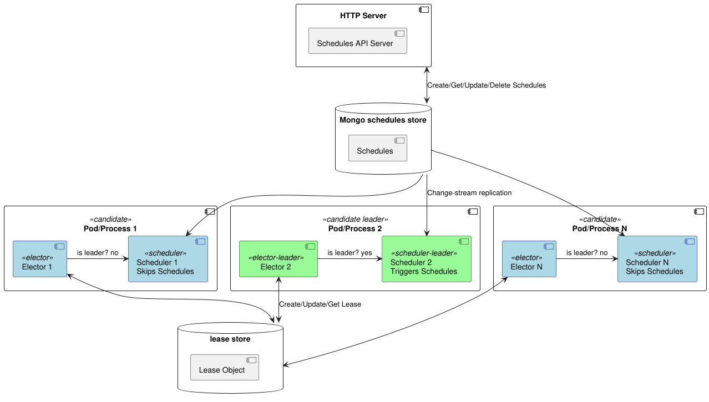

# hascheduler



Highly available and distributed scheduler demo using [leader-election](https://github.com/rbroggi/leaderelection) and 
[MongoDB change streams](https://www.mongodb.com/docs/manual/changeStreams/). The environment is based on a Kubernetes 
[Kind](https://kind.sigs.k8s.io/) cluster.

## Description

This repository provides a demo of a distributed scheduler application that uses leader election to ensure only one instance is active at a time.
The scheduler is notified of changes in a MongoDB collection using change streams and processes the changes accordingly. The passive replicas 
are ready to take over if the active instance fails or shutdown. The application is containerized using Docker and deployed on a Kubernetes cluster.

The demo includes:

- A Go application that implements the scheduler logic. The application also exposes a CRUD HTTP API for creation, retrieval, and deletion of schedules.
- A MongoDB instance to:
  - store the schedules and notify the scheduler instances of changes using change streams.
  - store the leader election lease.

## Start the Demo

```sh
make up
```
The command above does:
* Creates a kind cluster;
* Builds the Go application `hascheduler` and a Docker image containing it;
* Uploads the image to the kind cluster;
* Creates a MongoDB instance and initializes a replica set (necessary for change streams);
* Applies the manifests for the MongoDB and the `hascheduler` application.

The demo uses a `hascheduler` deployment with 3 replicas. The leader election ensures that only one instance is active at a time. 
The other instances are passive and ready to take over if the active instance fails or shutdown.

To create, update, list, delete schedules you can find some utility methods in the Makefile. For example:

```sh
make create-schedule
make get-schedules
make update-schedule ID=<schedule_id>
make delete-schedule ID=<schedule_id>
```

You can refer to the files under [payloads](./payloads) folder to manipulate the schedules to be created or updated.
